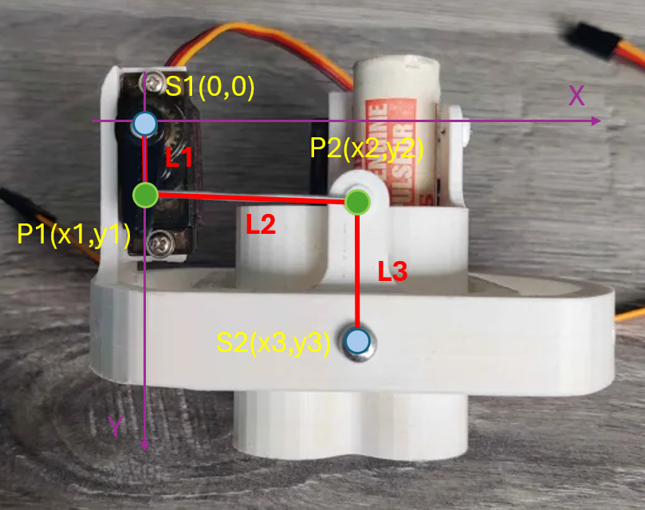
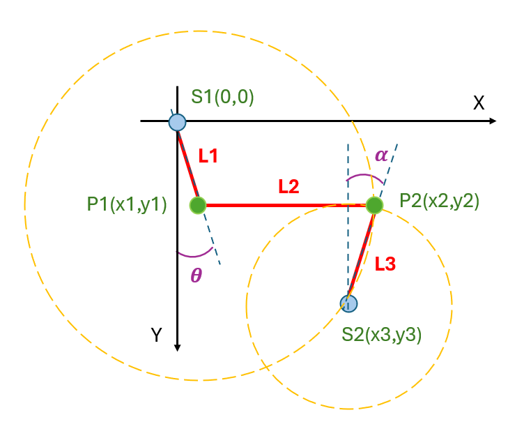
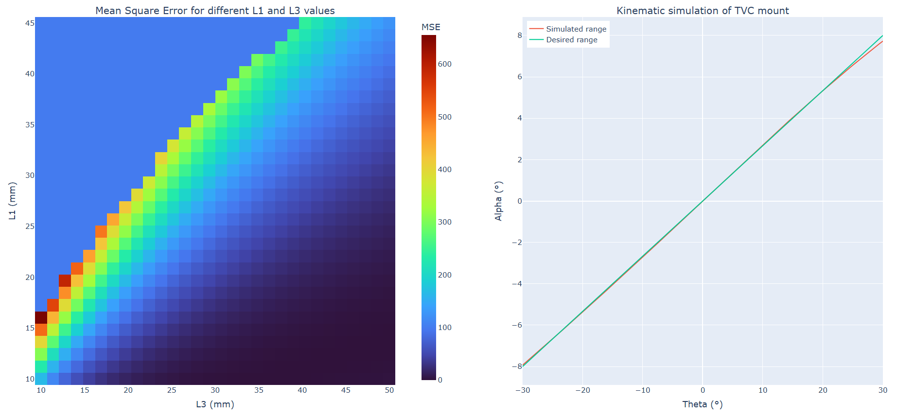

# TVC mount generator

Goal is to generate a TVC mount that approximates your desired behaviour!

 

## Mathmatical description of kinematics
This is a 3 bar linkage system. Known variables are $S1,S2,L1,L2,L3,\theta$.

First step is to find the P1 coordinates.

$$x_1 = L1 \sin(\theta)$$
$$y_1 = L1 \cos(\theta)$$

This is now the center of the circle which P2 can evolve around.
P2 is at the intersection of this circle and the circle where P2 evolves around S2.

$$(x_2-x_1)^2+(y_2-y_1)^2=L2^2$$
$$(x_2-x_3)^2+(y_2-y_3)^2=L3^2$$

Taking the intersection of these two equation gives 2 points. The one with the lowest y coordinate is P2.

$$\alpha = sin^{-1}(\frac{x_2-x_3}{L3})$$

## Automatic design 
You can generate a TVC with a desired behavior. Take a look at the "optimization_example.py" on how to use it.
First, define a desired relation $\theta$ and $\alpha$. Also, give it a range of $L1$ and $L3$ values with a gridsize.

The algorithm creates a 2D grid of discrete values of $L1$ and $L3$ where it simulates the model and calculates the MSE between the model and the desired relation. At the end it takes the cell, the model, with the lowest MSE as best approximation. It is possible that the values you gave the algorithm cannot produce a good approximation of your desired relation. In that case you will need to change the parameters. This can be increasing the range of $L1$ or/and $L3$, relaxing the relation(=making the slope steeper). 

