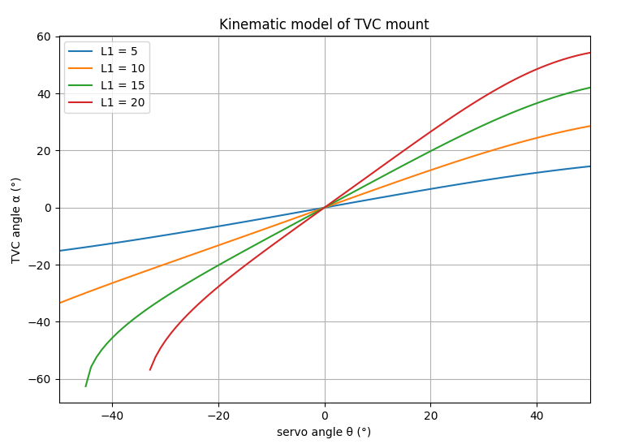
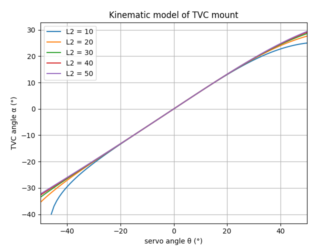
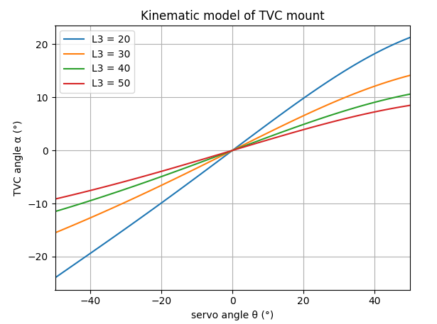
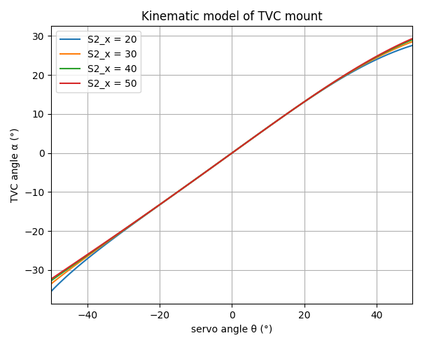
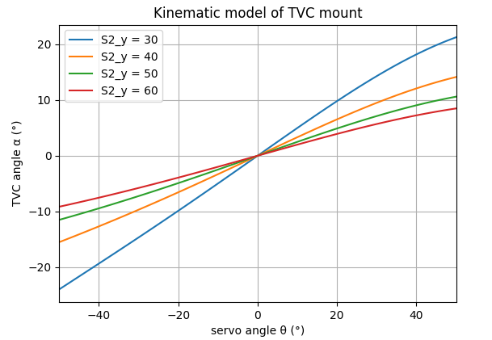

# Parameters influence study
This file goes into detail why the design parameters are chosen.

## Constraints
To simply the transferfunction of the system, we want to make sure that when the servo motor angle $\theta$ is 0° that the TVC mount angle $\alpha$ is also 0°. We can enforce this by making sure that S2_x = L2.

Also S2_y needs to be constraint to S2_y = L1+L3.

## Relations influence
### L1 changing
What happends when L1 changes length, but rest stays constant?
It seems like changing L1 has a great influence on the kinematic model. Keeping L1 smaller makes the model more linear, so is preferred. This will be used as design DOF.

### L2 changing
What happends when L2 changes length, but rest stays constant?
The influence of L2 is neiglible and wont be used as design DOF. Here it is better to not make L2 small in comparison to the other linkages, else non linearities start to occur on the ends of the ranges of the servo angle.

### L3 changing
What happends when L3 changes length, but rest stays constant?
Changing L3 influences the kinematic model significant, so can be used as design DOF.

### S2_x changing
What happends when S2_x changes location, but rest stays constant?
influence is neiglible, the reason is because of the constraint, in the background L2 changes which also had little influence.

### S2_y changing
What happends when S2_y changes location, but rest stays constant?
When changing S2_y, then L3 changes too to uphold the constraint. This translates in a significant influence because of the significant influence that changing L3 has. But we will keep this point constant and not use it as design DOF.

# Design Degrees Of Freedom (DOF)
A design DOF is a parameter that can be used for the optimal design algorithm
| Parameter | Is constraint? | Is design DOF? |
|-----------|----------------|----------------|
| L1        | False          |True            |
| L2        | False          |False           |
| L3        | False          |True            |
| S2_x      | True           |False           |
| S2_y      | True           |False           |
